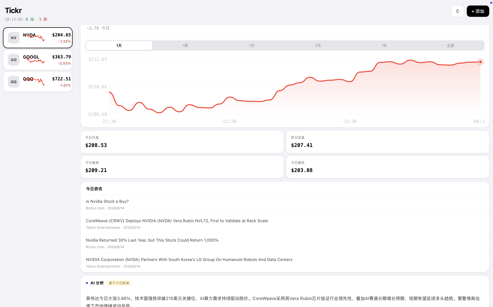

# Tickr

AI-powered stock tracker for global markets. Built with Next.js + Claude API.

**Live:** https://tickr-lovat.vercel.app

## What it does

- Real-time quotes via Finnhub API
- Candlestick / line charts via Yahoo Finance  
- Today's news aggregation via NewsAPI
- AI market analysis powered by Claude API (based on today's news)
- Watchlist management with mobile-responsive Apple-style UI

## Tech Stack

Next.js · TypeScript · Finnhub API · Yahoo Finance · NewsAPI · Claude API · Vercel

## Why I built this

Existing stock apps show data but don't synthesize it. Tickr combines real-time prices, today's news, and AI interpretation in one place — designed with an Apple-style dual-panel UI for clarity and built entirely independently from product definition to deployment.

## Architecture

Finnhub (real-time quotes) + NewsAPI (news) + Yahoo Finance (candlestick) → Next.js API Routes (server-side proxy, CORS handling, 5-min cache) → Claude API (AI analysis) → Client
